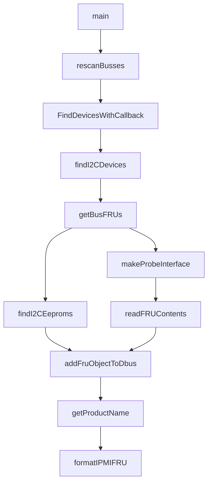
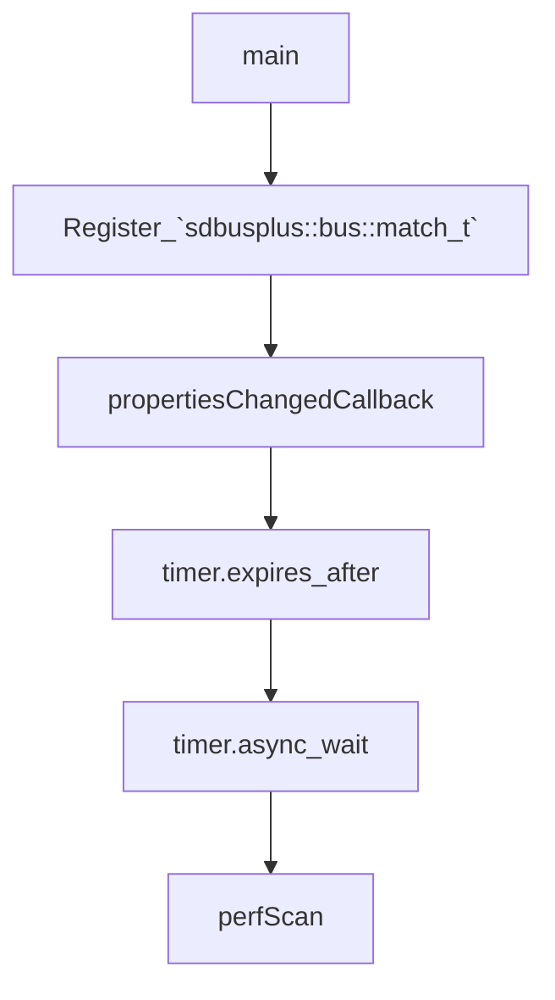
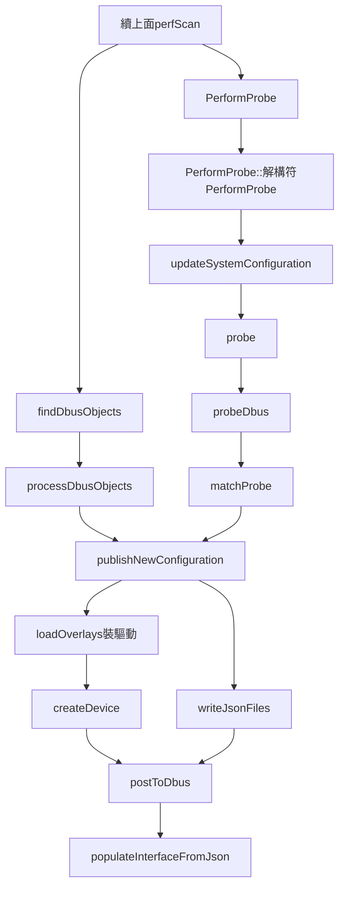

<h2>
    Topci
</h2>

[TOC]

<h2>
    Entity Manager
</h2>

EntityManager 是 OpenBMC 中的服務，負責管理硬體實體（例如感測器、電源、風扇等）的狀態和設定資訊。它透過監控感測器資料、執行控制操作以及記錄事件來實現對硬體的有效管理。

Entity Manager 是一種**用於管理實體系統元件**並將它們對應到 BMC 內的軟體資源的設計。

所述資源旨在允許在運行時靈活調整系統，並減少需要建立的獨立系統配置的數量。

這個可執行檔負責根據 fru-device 等「探測器」掛在dbus 上的內容，將本地的 json 與之進行匹配，**選出那些存在的設備**，再去完整的初始化這些設備（安裝驅動），最後，將這些可用的設備所對應的 json 配置進行一個組合，合併形成 **system.json** 放置在 /var/configuration/system.json 。

**最後，entity-manager 將這個 json 的條目推上 dbus 供其它服務使用**。

[Entity Manager config format](https://github.com/openbmc/entity-manager/blob/master/CONFIG_FORMAT.md)

<h2>
    Goals
</h2>

Entity Manager 有以下目標：
* 最大限度地減少將 OpenBMC「移植」到新系統所需的時間和調試
* 減少平台之間不同的程式碼量
* 從長遠來看，跨數百個平台和元件建立系統級可維護性，以便元件盡可能在實體上進行互通。

<h3>
    Feature
</h3>

**EntityManager 的功能**

* 感測器監控與數據收集： EntityManager 負責監控系統中各種感測器（例如溫度感測器、電壓感測器等）的數據，並定期收集這些數據。這有助於系統監控和故障診斷。
* 實體狀態管理： EntityManager 追蹤每個硬體實體的狀態，包括運作狀態、健康狀態和設定資訊。這使得系統管理員可以隨時了解硬體設備的運作狀況。
* 事件日誌記錄： EntityManager 記錄系統中發生的重要事件，如感測器狀態變更、電源控制操作等。這些日誌有助於故障排除和系統效能分析。
* 實體控制： EntityManager 允許系統管理員執行各種控制操作，如重置感測器、調整風扇轉速等，以確保系統的穩定運作。


**EntityManager 的工作原理**

1. 初始化階段： 在系統啟動時，EntityManager 負責初始化各個子模組，並建立與硬體實體的連線。
2. 感測器監控： EntityManager 定期輪詢系統中的感測器，收集其數據，並根據預設的閾值進行狀態偵測。
3. 事件記錄： 當感測器狀態變更或其他重要事件發生時，EntityManager 將相關資訊記錄到事件記錄檔中。
4. 實體控制： 當管理員需要對硬體實體進行控制時，他們可以透過與 EntityManager 通訊發送相應的指令，EntityManager 會接收並執行這些指令。
5. 狀態更新： EntityManager 定期更新硬體實體的狀態信息，並向其他系統元件提供最新的狀態資料。

<h2>
    Design Architecture
</h2>

OpenBMC 的社群設計，將零件管理分為三大模組：
* Detector
* Configuration Manager
* Executor

**Detector** 用於發現硬體設備並蒐集這些設備的原始資訊。
這些原始資訊將被推送至 dbus 上，供「Configuration Manager」之類的其它模組使用。
* FRU-Device

**Configuration Manager** 負責將本地的設定檔與「設備原始資訊」進行匹配，從而正確的識別這些設備並形成更詳細的設備配置資訊。
這些配置資訊也將被推送至 dbus 上，供「Executor」之類的其它模組使用。
* entity-manager

**Executor** 有許多不同的種類。它們所做的事，是根據「Configuration Manager」掛在 dbus 上的信息，找出自己可以操作的設備，獲取需要的信息，最後再將信息推回到 dbus 上。
* dbus-sensors


1. Detector 掃描到了一個硬體設備，但只知道這個設備的 **id** 是 xxxx ，所以它將這個 id 推送到了 dbus 上。
2. Configuration Manager 根據這個 **id** ，結合本地的配置文件，確定了這到底是哪一張板卡。
於是「Configuration Manager」便可以**往 dbus 上推送**與這張板卡有關的訊息，例如它的名稱、描述，它所帶有的感測器位址等等。
3. Executor 根據 Configuration Manager 提供的感測器位址信息，讀取感測器數據，**最終將數據推回 dbus 上**。

由於**所有資料都在 dbus 上**，因此，需要獲取資訊的東西，如 bmcweb 提供的 redfish 接口，便可以輕鬆的從 dbus 上拿到任何想要的東西。

***Summarize :***

1. Scaning hardware device
2. Combinning configuration to push information to dbus
3. Reading Sensor data then pushing the data back into Dbus

```
1. Scaning hardware devide for FRU-Device (Obtaining device id)
2. Device ID based on FRU-Device. Combining local Configuration document(entity-manager), then push information to dbus
3. Dbus-sensors based on Entity-Manager reading Sensor data then pushing the data back into Dbus
```

<h2>
    Entity Manager Structure of Recipe
</h2>

meson.build
```
......

executable(
    'entity-manager',
    'entity_manager.cpp',
    'expression.cpp',
    'perform_scan.cpp',
    'perform_probe.cpp',
    'overlay.cpp',
    'topology.cpp',
    'utils.cpp',
......
)

......
    executable(
        'fru-device',
        'expression.cpp',
        'fru_device.cpp',
        'utils.cpp',
        'fru_utils.cpp',
        'fru_reader.cpp',
......
    )
......
```

Entity-Manager 會建立兩個可執行檔
* entity-manager
* fru-device

這兩個可執行檔分別是由 `xyz.openbmc_project.EntityManager.service` 和 `xyz.openbmc_project.FruDevice.service` 獨立負責啟動的，兩者在啟動時並沒有直接的依賴關係

<h2>
    How to work
</h2>

<h3>
    FRU-Device
</h3>

工作內容：它需要在沒有裝置驅動的情況下掃描所有 i2c 總線下的每一個位址（實際上是指定範圍的位址），如果發現位址上存在 FRU ，則解析 FRU 的內容並將其推到 dbus 上。

FRU 它是一種電子標籤，用以儲存零件資訊。

在實體上，它一般儲存在板卡上的特有 EEPROM 裡，與 BMC 透過 i2c 的方式取得連接。 

FRU-Device 在根本上所做的事，便是透過 i2c 來尋找 FRU ，從而發現各種各樣的板卡。

[Code 解析](<https://blog.xzr.moe/archives/489/#:~:text=%E5%A6%82%E4%BD%95%E5%B7%A5%E4%BD%9C%E7%9A%84%E3%80%82-,fru%2Ddevice,-%E6%A6%82%E8%BF%B0>)

fru-device 負責在沒有裝置驅動的情況下發現 i2c 總線上所有可能存在的 FRU ，讀取解析 FRU 的內容並將其掛在 dbus 上。


<h3>
    Entity-Manager
</h3>

Entity-Manager 負責根據 fru-device 等「**Detector**」掛在dbus 上的內容，將本地的 json 與之進行匹配，選出那些存在的設備，再去完整的初始化這些設備（安裝驅動），最後，將這些可用的設備所對應的 json 配置進行一個組合，合併形成 **system.json** 放置在 `/var/configuration/system.json` 。

最後，entity-manager 將這個 json 的條目推上 dbus 供其它服務使用。

其所做的最重要的事情，便是根據先前 **“Detector”** 的原始結果，對 json 中的 `$bus`、`$address` 等變量進行填充，得到真正完整可用的配置文件。

**`boost::asio`** 是 Boost 函式庫中的一個模組，用於提供非同步 I/O 和網路程式設計的功能。它是一個跨平台的函式庫，可以在多種作業系統上使用，包括 Windows、Linux 和 macOS。他提供了一種基於事件驅動的程式設計模型，使得開發網頁應用程式和非同步 I/O 更加簡單和有效率。


[asio libary](<https://zhuanlan.zhihu.com/p/55503053>)

[Code 解析](<https://blog.xzr.moe/archives/489/#:~:text=%E4%B8%AD%E5%8A%A8%E6%80%81%E7%94%9F%E6%88%90%E3%80%82-,entity%2Dmanager,-%E8%BF%99%E4%B8%AA%E5%8F%AF%E6%89%A7%E8%A1%8C>)

<h2>
    Entity Manager Configure
</h2>


左邊那一塊是 EntityManager 原本就有的, OpenBMC 原本說 Sensor number 不重要


<h2>
    work flow
</h2>

FRU-Device : 


>**rescanBusses()** 會建立一個 **FindDevicesWithCallback** 回呼。這個回調會在掃描完成後被調用


Entity-Manager : 



>EntityManager 中有兩個 `sdbusplus::bus::match_t` 來去監聽 dbus 上的介面增刪事件, 但凡有服務在 dbus 上創建或刪除了接口，entity-manager 都能感知到，回呼函數也會被調用。

>`propertiesChangedCallback` 他是 Entity Manager 的核心, 在 entity-manager 啟動時或發生「刷新」時，它都會被調用

**propertiesChangedCallback**
1. 載入 `entity-manager` 的本機設定檔。
2. 根據本機設定文件，掃描和匹配「Detector」推送在 dbus 上的介面。
3. 綜合本地配置和「Detector」推送在 dbus 上的 information，合成 system.json 配置，代表所有可用的設備/闆卡。
4. 推送 system.json 到 dbus ，以及一些雜項處理（例如為設備安裝驅動、移除先前存在但現在消失了的設備等）。

「**刷新**」發生時，上面的 1 2 3 4 步都會被完整的重跑一次。

[timer.async_wait 執行流程](<https://blog.xzr.moe/archives/489/#:~:text=%E7%AC%AC%E4%B8%80%E5%B1%82%EF%BC%8C%E6%98%AF%20timer%20%E7%9A%84%E5%9B%9E%E8%B0%83%EF%BC%8C%E4%B9%9F%E5%B0%B1%E6%98%AF%205%20%E7%A7%92%E6%B6%88%E6%8A%96%E5%90%8E%E8%A6%81%E5%81%9A%E7%9A%84%E4%BA%8B%EF%BC%9B%E7%AC%AC%E4%BA%8C%E5%B1%82%EF%BC%8C%E6%98%AF%20PerformScan%20%E7%9A%84%E5%9B%9E%E8%B0%83%EF%BC%8C%E4%B9%9F%E5%B0%B1%E6%98%AF%E5%9C%A8%E6%96%B0%20system.json%20%E5%87%86%E5%A4%87%E5%A5%BD%E6%97%B6%EF%BC%88%E4%BD%86%E5%B0%9A%E6%9C%AA%E6%8C%81%E4%B9%85%E5%8C%96%EF%BC%89%E8%A6%81%E5%81%9A%E7%9A%84%E4%BA%8B%E3%80%82>)


D-Bus : 

他有分**明線**與**暗線**, 左明右暗 (RAII 機制)
明線：掃描並取得「探測器」推送到 dbus 上的接口
暗線：配置


**PerformScan**
這一塊內容做了下面幾件事：
1. 掃描和取得「Detector」推送到 dbus 上的介面。
2. 根據 1 所取得的介面內容，配對並啟動本機設定檔。
3. 根據 1 取得到的介面內容，完成設定檔中的範本變數替換。
4. 合成 system.json 。

**updateSystemConfiguration**
1. 為設定檔計算 checksum 。
2. 完成模板變數到實際值的替換。
3. 將設定檔以子 json object 的形式增加到 system.json 中。

<h2>
    compare phosphor-inventory-manager and entity-manager
</h2>

| Compare terms                      | phosphor-inventory-manager                                             | entity-manager                                                               | P.S.                                                                                                                |
| ---------------------------------- |:---------------------------------------------------------------------- | ---------------------------------------------------------------------------- | ------------------------------------------------------------------------------------------------------------------- |
| Depends-on service                 | None                                                                   | None                                                                         | Although entity-manager use fru-device for probe target, it's still can start first                                 |
| configuration file                 | yaml for dbus-interface/expose timing, json for association            | json                                                                         | yaml is decide at build time, json is run-time changeable                                                           |
| service use the configurations     | create association for sensors, and bmcweb(redfish) can get the sensor | dbus-sesnors for sensor initialize                                           |                                                                                                                     |
| how to set "must expose"           | use type startup                                                       | set probe with TRUE                                                          |                                                                                                                     |
| timing about expose dbus-interface | startup or match dbus-signal                                           | fru-device dbus-interdace changed or dbus method trigger re-sync             |                                                                                                                     |
| association                        | configure in json and create dbus object in phosphor-inventory-manager | use the type of entity config in json and create dbus object in dbus-sensors |                                                                                                                     |
| effect on SDR?                     | no effect                                                              | effect                                                                       | phosphor-ipmi-host decide SDR in yaml file at build time, intel-ipmi-oem detect sensor and generate SDR in run-time |
| others                             | None                                                                   | I2C Mux initialize in entity-manager                                         |                                                                                                                     |